# Buy or Wait? — Progress and Correctness Baseline

Generated from the current repository state on branch `main`.

## Traceability

- Branch: `main`
- Current tracked production file: `code/main.py`
- Sample-comparison checkpoint: `5fcccc1` (`test: add sample comparison harness and baseline`)
- Documentation checkpoint: `fa486bc` (`docs: record implementation status and forecast discrepancies`)
- Salary amendment checkpoint: `a42fc85` (`fix: persist salary amendments across recurring projections`)
- Evidence interface checkpoint: `173b1e4` (`feat: add validated evidence extraction interface`)
- Remaining uncommitted paths are unrelated artifacts listed in [Change inventory](#change-inventory).

This report records the initial baseline plus the targeted four-request audit and one evidence-backed salary-amendment correction. No correction factor, historical-maxima policy, or extra reserve was used for the safe-amount discrepancies; no commit or push was performed.

## Current implementation

The solution is a deterministic, dependency-free Python engine. It does not call an LLM, vision API, hosted model, network service, or external banking service.

### Entry points

The production entry point is:

```text
code/main.py:main()
```

It loads `dataset/requests.csv`, evaluates every request with `Agent.decide()`, validates the generated rows, and writes the root-level `output.csv`.

The diagnostic entry point is:

```text
code/compare_samples.py:main()
```

It loads all rows from `dataset/sample_requests.csv`, calls the existing engine directly, prints comparisons, and traces `request_02`. It deliberately does not call production `main()` and does not write `output.csv`.

### Architecture and execution flow

```mermaid
flowchart LR
    csv["dataset CSV files"] --> data["Data loader"]
    images["IMAGE_AMOUNTS map"] --> data
    data --> typed["Profile / Event / Option structures"]
    typed --> evidence["Payroll message + image evidence"]
    typed --> projection["Explicit + recurring projection"]
    evidence --> projection
    projection --> replay["Daily balance replay"]
    replay --> safe["Safe amount + earliest full date"]
    safe --> plans["Plan generation and spending changes"]
    projection --> plans
    plans --> rank["Plan ranking"]
    rank --> decide["Agent.decide"]
    decide --> validate["validate"]
    validate --> output["output.csv"]
```



Major components in `code/main.py`:

- `Data.__init__()` loads profiles, requests, events, messages, options, and exchange rates, then builds indexes by user and request.
- `Data._profiles()` parses user balances, minimums, protected categories, flexible categories, accepted payment methods, and installment limits.
- `Data._events()` parses financial events and fills blank amounts from the hardcoded image facts below.
- `Data._options()` parses provider payment options.
- `Data.convert()` applies direct, inverse, or fallback dated exchange rates.
- `Agent.relevant_messages()` filters messages relevant to a user/request and request date.
- `Agent.message_facts()` uses a narrow regular expression to extract dated payroll amounts.
- `Agent.explicit_projection()` includes future settled, pending, and scheduled cash events while excluding failed, cancelled, unrealized, and pending-credit events.
- `Agent.recurring_projection()` infers approximate weekly, biweekly, monthly, or two-month recurrences from historical settled events.
- `Agent.projections()` combines explicit events, inferred events, and payroll-message facts while removing some same-key/same-date duplicates.
- `Agent.replay()` applies cash events day by day, credits before debits, then proposed payments, stopping at the first minimum-balance violation.
- `Agent.safe_amount()` calculates unchanged-baseline headroom above the minimum balance.
- `Agent.earliest_full()` tries a full payment on each day of the 90-day window.
- `Agent.eligible_changes()` finds permitted flexible recurring events.
- `Agent.plans()` generates full, partial, installment, wait, and changed-spending plans.
- `Agent.rank()` applies the implemented plan ordering.
- `Agent.decide()` selects a plan and formats all required output fields.
- `validate()` checks output shape, bounds, enums, payment totals, installment schedule equality, and basic spending-change syntax.

### Hardcoded image facts

Runtime image extraction is not implemented. The 16 supplied image amounts were manually transcribed into `IMAGE_AMOUNTS` in `code/main.py` and joined to events using `images.csv.related_event_id`:

```text
image_01: 4365000
image_02: 100000
image_03: 41272
image_04: 2854
image_05: 704.05
image_06: 79679.26
image_07: 8528.10
image_08: 15339
image_09: 723
image_10: 79679.26
image_11: 3650
image_12: 33.50
image_13: 2298
image_14: 4593
image_15: 9968
image_16: 393.22
```

If an amount is blank and there is no mapped image fact, `_events()` skips the event rather than treating it as zero or failing the run.

### Limited message parsing

Only explicit, dated payroll-like messages are parsed. `message_facts()` recognizes a limited set of English/Indonesian payroll words and extracts one amount and one ISO date. It does not fully interpret cancellations, rent amendments, provider notices, refunds, bank disputes, or foreign-currency message amounts. The stated currency is not retained in the extracted tuple, so the parser effectively treats the extracted value as a home-currency amount.

### Known implementation limitations

- `linked_event_id` is loaded but no full lifecycle graph is reconciled. Status filtering exists, but linked duplicates, replacement events, failed retries, amendments, and settlement precedence are not comprehensively resolved.
- `request_text`, `request_type`, and profile `financial_priorities` are loaded or available but do not materially influence the final decision.
- Exchange-rate fallback uses the latest rate on or before the settlement date when an exact rate is unavailable, rather than failing or proving that the challenge permits the fallback.
- Historical recurring expenses are grouped mostly by category and use a heuristic recent median or upper-quartile amount. This is not proven to match the organizer's reserve policy.
- Recurring income is restricted to descriptions containing salary/payroll-like terms, while commission and gig-like streams are excluded by keyword.
- `max_installment_months` is approximated by comparing the number of payments to the maximum months; this is not the same as measuring schedule duration.
- The validator uses Python `assert` statements, which can be disabled with optimization flags, and it does not fully validate spending-change targets or every provider-option invariant.
- Decision explanations are deterministic but may omit the selected spending changes.
- Existing tests do not cover all lifecycle, recurrence, message, currency, boundary, ranking, and validation cases.

## Completed work

### Initial implementation

Implemented the deterministic engine in `code/main.py` with:

- Decimal monetary parsing and output formatting
- Profile/event/message/option/rate loading
- Source-linked manual image amounts
- Pending debit and pending credit treatment
- Explicit future-event projection
- Heuristic recurrence projection
- Payroll-message extraction
- Daily minimum-balance replay
- Safe-amount and earliest-full-payment calculations
- Full, partial, installment, wait, and not-recommended plans
- Flexible spending changes limited by profile permissions
- Output validation and CSV generation

### Architecture review

Inspected the implementation in execution order and identified the distinction between:

- implemented deterministic arithmetic and planning
- manually transcribed image evidence
- limited payroll-only message parsing
- heuristic recurrence forecasting
- missing linked-event reconciliation
- missing AI/model integration
- incomplete independent validation

### Diagnostic harness

Added `code/compare_samples.py` without changing production financial logic. It:

- evaluates all 25 solved samples using the existing engine
- compares Decimal amounts numerically
- compares payment plans as ordered date/amount schedules
- records exceptions rather than skipping failures
- checks explanation consistency independently of exact wording
- traces `request_02` with a full diagnostic ledger

The reproducible output from the baseline run is saved at:

```text
evaluation/sample_baseline.txt
```

## Baseline results

The diagnostic run processed all 25 samples with no exceptions.

| Field | Matches |
|---|---:|
| `amount_safe_to_pay` | 3/25 |
| `affordability_status` | 19/25 |
| `recommended_payment_method` | 21/25 |
| `payment_plan` | 21/25 |
| `earliest_date_for_full_payment` | 17/25 |
| `spending_changes_needed` | 20/25 |
| explanation consistency | 25/25 |

The exactly matching requests across the compared fields were:

```text
request_09
request_12
request_16
```

### Complete mismatch table

For monetary rows, `difference` is `actual - expected`. Payment-plan comparisons are structural, so harmless decimal formatting differences are not counted as mismatches.

| Request | Mismatched fields | Expected amount | Actual amount | Difference |
|---|---|---:|---:|---:|
| request_01 | amount, status, method, plan, earliest date | 25256 | 6242.62 | -19013.38 |
| request_02 | amount | 17229139.2 | 17864721.20 | +635582.00 |
| request_03 | amount | 873000 | 1089018.06 | +216018.06 |
| request_04 | amount | 8401800 | 10132985.41 | +1731185.41 |
| request_05 | amount | 737 | 0 | -737 |
| request_06 | amount, status, earliest date, changes | 603.3 | 620.40 | +17.10 |
| request_07 | amount | 87170.56 | 94391.34 | +7220.78 |
| request_08 | amount, status, method, plan, earliest date | 284.57 | 369.70 | +85.13 |
| request_10 | amount | 12700 | 0 | -12700 |
| request_11 | amount, status, earliest date, changes | 12510645 | 13110000 | +599355 |
| request_13 | amount, status, method, plan, earliest date | 433.4 | 325.23 | -108.17 |
| request_14 | amount | 597.74 | 0 | -597.74 |
| request_15 | amount | 83.05 | 0 | -83.05 |
| request_17 | amount, earliest date, changes | 243849.58 | 237498.83 | -6350.75 |
| request_18 | amount | 462 | 646.65 | +184.65 |
| request_19 | amount, method, plan, earliest date | 28820 | 39660 | +10840 |
| request_20 | amount | 5400 | 17006.40 | +11606.40 |
| request_21 | amount, status, earliest date, changes | 1543.35 | 1574.40 | +31.05 |
| request_22 | amount, changes | 475.46 | 469.81 | -5.65 |
| request_23 | amount | 9152 | 10113.63 | +961.63 |
| request_24 | amount | 13420 | 13080.61 | -339.39 |
| request_25 | amount | 1425000 | 2388502.63 | +963502.63 |

## Request-02 investigation

The diagnostic used solved sample row `request_02` directly with the existing `Agent`, without invoking production `main()`.

### Starting state

```text
request date: 2025-08-05
forecast end: 2025-11-03
home currency: IDR
starting balance: 60,383,889.20 IDR
protected minimum: 29,158,400 IDR
requested amount: 46,018,000 IDR
desired completion date: 2025-10-10
accepted methods: partial_payment, installments
max installment months: 7
```

### Observed low point

The current engine's full baseline replay observed:

```text
lowest baseline balance: 47,023,121.20 IDR
lowest balance date: 2025-08-13
actual safe amount: 17,864,721.20 IDR
sample expected safe amount: 17,229,139.20 IDR
difference: +635,582.00 IDR
```

The sample's expected safe amount implies a balance of:

```text
29,158,400 + 17,229,139.20 = 46,387,539.20 IDR
```

That arithmetic does not establish that the expected low point occurred on 2025-08-13; the expected low-point date is unknown from the sample output alone.

### Cash-flow events leading to the observed low point

These are the eight projected debits through 2025-08-13. Inferred events retain their historical source ID; `event_185` is an explicit pending debit.

| Date | Direction | Category | Amount | Source ID | Source description/status |
|---|---|---|---:|---|---|
| 2025-08-07 | debit | utilities | 2,081,730.85 | inferred from `event_138` | Municipal utilities / settled |
| 2025-08-08 | debit | insurance | 1,132,400 | inferred from `event_139` | Household insurance / settled |
| 2025-08-08 | debit | shopping | 1,651,100 | explicit `event_185` | Pending merchant debit / pending |
| 2025-08-09 | debit | education | 3,040,000 | inferred from `event_140` | Course tuition / settled |
| 2025-08-09 | debit | groceries | 2,218,141.61 | inferred from `event_162` | Supermarket basket / settled |
| 2025-08-11 | debit | healthcare | 1,538,498.10 | inferred from `event_141` | Clinic payment / settled |
| 2025-08-12 | debit | transport | 1,329,347.44 | inferred from `event_175` | Metro and bus fares / settled |
| 2025-08-13 | debit | cloud storage | 369,550 | inferred from `event_143` | Shared storage plan / settled |

Total depletion through the observed low point:

```text
13,360,768.00 IDR
```

The calculation is:

```text
60,383,889.20 - 13,360,768.00 = 47,023,121.20 IDR
```

### Salary amendment

The relevant evidence is `message_01`, sent on 2025-07-29 by the employer. It states that monthly salary increased to:

```text
42,750,000 IDR effective 2025-08-15
```

`Agent.message_facts()` extracted:

```text
2025-08-15: 42,750,000 IDR
```

The salary amendment does not affect the observed low point because the low point occurs on August 13. The engine generated one message salary and removed one same-date inferred salary projection so the amendment was not double-counted.

### Conversions, duplicates, and recurrence handling in this trace

- All request-02 events are already in IDR; no currency conversion occurred.
- There were 1 explicit future projection and 38 inferred recurring projections before final combination.
- No recurring projection was removed for an explicit same-date/category/direction collision.
- One same-date inferred salary was removed because of the employer message amendment.
- No linked-event graph reconciliation occurred. `linked_event_id` is loaded by the engine, but no linked event was resolved in this trace.
- The pending debit was included; pending credits would be excluded by `status_counts_as_cash()`.

## Evidence versus hypotheses

### Confirmed by code and diagnostic output

1. The current engine uses the eight listed cash-flow events to reach its observed 2025-08-13 low point.
2. The current engine's safe amount is the observed low balance minus the protected minimum.
3. The current engine uses a recent upper-quartile-like value for variable expense recurrences in `Agent.recurring_projection()`.
4. The salary message is parsed as a dated IDR credit on 2025-08-15.
5. The salary message replaces one same-date inferred salary projection.
6. No currency conversion or linked-event reconciliation occurs for request 02.
7. The current engine does not use an AI model or external service.

### Possible explanations, not established facts

Historical maxima are an unverified hypothesis. If the current projected values are replaced by historical category maxima for early variable categories, the additional reserve would be:

| Category | Current projected amount | Historical maximum | Difference |
|---|---:|---:|---:|
| utilities | 2,081,730.85 | 2,143,659.02 | +61,928.17 |
| groceries | 2,218,141.61 | 2,477,697.53 | +259,555.92 |
| healthcare | 1,538,498.10 | 1,641,668.72 | +103,170.62 |
| transport | 1,329,347.44 | 1,440,242.94 | +110,895.50 |
| **total** |  |  | **+535,550.21** |

This explains much of the 635,582 IDR discrepancy, but it does not prove that the organizer uses historical maxima. The remaining:

```text
635,582.00 - 535,550.21 = 100,031.79 IDR
```

has no single obvious source event in the current trace and remains unexplained. No multiplier or hardcoded correction was applied.

The expected safe amount does not reveal the expected low-point date. It is not valid to assume that the expected reserve was accumulated by exactly the same August 13 event sequence.

## Targeted four-request audit and one coherent correction

The complete read-only audit is saved separately at:

```text
evaluation/request_targets_investigation.txt
```

It contains the relevant profile, event, message, and image rows for `request_01`, `request_02`, `request_05`, and `request_20`; every recurrence group with historical source IDs, cadence, inferred dates, and amounts; final 90-day projections; daily baseline balances; first minimum-balance breach; and a full-request replay. It also records that the only loaded starting snapshot is `current_available_balance`; no independent balance-snapshot event is available.

### Findings by request

| Request | Current safe / expected | Full 90-day baseline result | Finding |
|---|---:|---|---|
| `request_01` | 6,242.62 / 25,256 ZAR | Low 24,242.62 ZAR on 2024-06-01; no baseline breach. A full payment first breaches on 2024-05-02 at 15,460.72 ZAR. | Recurrence groups are source-backed: monthly rent/utilities/education/debt/subscriptions plus weekly groceries/transport and biweekly dining. The sample does not identify a different low date or reserve rule, so changing recurrence amounts would be speculative. |
| `request_02` | 17,864,721.20 / 17,229,139.20 IDR | Low 47,023,121.20 IDR on 2025-08-13; no baseline breach. | The pre-amendment low is fully explained by the listed projected debits. `message_01` is a confirmed future salary amendment defect, but it occurs after the low and cannot explain this safe-amount mismatch. |
| `request_05` | 0 / 737 ZAR | Low 8,757.30 ZAR on 2026-02-04; first baseline breach on 2026-02-02 at 9,889.28 ZAR. | The final-employer-payroll record is explicitly the last income event, and the projected rent, utilities, debt, healthcare, family support, subscription, shopping, groceries, and transport series have source rows. The expected low date and reserve rule are not supplied; excluding one series would be unsupported. |
| `request_20` | 17,006.40 / 5,400 INR | Low 81,506.40 INR on 2026-02-13; no baseline breach. | Image `image_05` independently shows INR 704.05 for `event_1786` and is included. Pending debit `event_1787` is included; pending refund `event_1785` is excluded as an unreceived credit. The remaining difference has no source-proven missing event or lifecycle correction. |

### Confirmed request-02 amendment defect

The source series contains monthly settled payroll events `event_104`, `event_112`, `event_120`, `event_128`, and `event_136`, each IDR 33,345,000. `message_01` is an employer message received before the request and states:

```text
Gaji bulanan Anda naik menjadi IDR 42750000.
Perubahan ini berlaku mulai 2025-08-15.
```

Before this iteration, `Agent.projections()` removed the old salary only on the exact message date and appended the message salary there. It left the later inferred occurrences at the old amount:

```text
2025-08-15: 42,750,000  message_payroll
2025-09-15: 33,345,000  inferred from event_136  # incorrect
2025-10-15: 33,345,000  inferred from event_136  # incorrect
```

That behavior contradicts the explicit effective-date amendment. The smallest correction updates every projected salary occurrence on or after an applicable parsed amendment date while retaining the existing same-date replacement behavior. After the correction:

```text
2025-08-15: 42,750,000  message_payroll
2025-09-15: 42,750,000  inferred from event_136
2025-10-15: 42,750,000  inferred from event_136
```

The focused regression test is:

```text
code/test_main.py::FinancialAgentTests::test_salary_amendment_persists_to_later_occurrences
```

Its expected dates and amount come directly from the employer message's effective date and amount plus the supported monthly source series; it does not use the solved safe amount as its oracle.

### Why the correction does not change request-02 safe amount

The complete baseline replay's low occurs on 2025-08-13, before the amended salary begins on 2025-08-15. Therefore, the correction is source-correct but cannot change the current request-02 safe amount. The 635,582 IDR discrepancy remains unresolved without a justified reserve or recurrence-policy rule. The same principle prevents using this fix to alter `request_01`, `request_05`, or `request_20`.

### Unresolved assumptions and required clarification

- The sample outputs provide a safe amount but not the date of the expected low point. A monetary difference cannot be assigned to a specific event sequence without that date.
- The engine's category grouping is intentionally broad for expenses, but each target's grouped events have consistent cadences and source histories in the audit. No unrelated category merge, duplicate occurrence, or missing explicit event was established strongly enough to change production policy.
- Pending debit treatment is source-supported for `request_02` and `request_20`; pending credits are not available cash under the challenge rules. The request-20 refund message confirms that the pending credit has not reached the account.
- No separate balance snapshot, daily spending allowance, or organizer reserve statistic appears in the supplied evidence. The precise clarification needed is: **Should the 90-day reserve use the full projected cash timeline with the engine's recurrence statistic, and if so, what statistic and expected low-point date should be used for variable category spending?**
- Historical maxima, correction multipliers, and extra reserves remain intentionally unintroduced.

## Verification

### Checks run during this iteration

The saved baseline remains unchanged at `evaluation/sample_baseline.txt`. This iteration's comparison output is saved separately at:

```text
evaluation/sample_comparison_after_salary_fix.txt
```

Commands and results:

```bash
cd code && PYTHONDONTWRITEBYTECODE=1 python3 -m unittest test_main.FinancialAgentTests.test_salary_amendment_persists_to_later_occurrences -v
# 1 test passed

PYTHONDONTWRITEBYTECODE=1 python3 -m unittest discover -s code -p 'test_*.py' -v
# 8 tests passed

PYTHONDONTWRITEBYTECODE=1 python3 code/compare_samples.py > evaluation/sample_comparison_after_salary_fix.txt
# exit status: 0; samples: 25; exceptions: 0
```

The post-fix comparison has the same aggregate results as the saved baseline:

```text
amount_safe_to_pay: 3/25
affordability_status: 19/25
recommended_payment_method: 21/25
payment_plan: 21/25
earliest_date_for_full_payment: 17/25
spending_changes_needed: 20/25
explanation_consistency: 25/25
```

A full diff of the two comparison artifacts is empty, so this focused fix caused zero sample-output regressions and zero sample-output improvements. It corrects the future salary timeline but not any solved output field in these samples.

The diagnostic and tests did not invoke `code/main.py:main()` and did not overwrite `output.csv`. No push was performed.

### Incremental evidence-extraction interface

Model access was inspected without exposing secrets. No third-party SDK, OCR/vision package, or dependency manifest was needed; the adapter uses the standard library. The existing local `.env` contains a configured key, which was preserved and never printed, logged, committed, or packaged. A single live smoke extraction was completed successfully; the key value and raw authorization headers were not recorded.

The complete evidence inventory is saved at:

```text
evaluation/evidence_inventory.md
```

It covers all 215 messages, their source/request/event links and non-authoritative triage labels, all 16 images and their user/request/event links, manual reference amounts, current information gaps, and the `message_14` delayed-refund fixture.

### OpenRouter integration checkpoint

The provider-neutral layer is now connected to an OpenRouter adapter in `code/evidence_extraction.py`, while deterministic financial authority remains separate. The adapter provides:

- project-root `.env` loading without overriding existing environment variables;
- explicit missing-key and HTTP 401 errors without printing or logging the key;
- configurable `OPENROUTER_MODEL`, `OPENROUTER_BASE_URL`, timeout, retry count, and attribution headers;
- runtime model metadata verification requiring both `response_format` and `structured_outputs` support;
- strict `response_format.type=json_schema` requests with `provider.require_parameters=true` and `allow_fallbacks=false`;
- explicit timeout, bounded 408/409/429/5xx retries, `Retry-After` handling, and no fallback model;
- local schema validation after structured output;
- provider prompt/completion token usage and provider-reported cost, or an estimate from the verified model pricing when cost is absent;
- cache keys containing source content, complete prompt hash, model, prompt version, and schema version;
- cache reuse and duplicate-source protection through the existing extractor/ledger.

The chosen default is `mistralai/mistral-small-24b-instruct-2501`. At implementation time, the public OpenRouter Models API reported:

```text
availability: listed
input modalities: text
context: 32,768 tokens
structured_outputs: supported
response_format: supported
prompt price: $0.05 / 1M tokens
completion price: $0.08 / 1M tokens
expiration: none reported
```

This is a text-message model only; image extraction remains a separate checkpoint. Model metadata was checked through the public model listing before inference. The configured model then completed one live smoke extraction for `message_14`; the second smoke invocation reused the local evidence cache.

Official references used:

- [Authentication](https://openrouter.ai/docs/api/reference/authentication)
- [Structured outputs](https://openrouter.ai/docs/guides/features/structured-outputs)
- [Models API and pricing](https://openrouter.ai/docs/guides/overview/models)
- [API responses and usage](https://openrouter.ai/docs/api_reference/overview)
- [Limits and retries](https://openrouter.ai/docs/api_reference/limits)

### Message semantics and end-to-end integration

The original `message_14` says: “Your refund has been initiated but has not reached your account yet.” The underlying transaction is a **refund**; the update is **delayed**. The old single `action` field could represent either concept, so schema v2 adds required `transaction_type` and `update_status` fields while preserving `action` as a legacy update summary. A focused regression test validates `transaction_type=refund`, `update_status=delayed`, and `action=delay` independently.

A fixed, source-backed evaluation set of 19 actual messages was recorded in:

```text
evaluation/message_extraction_expectations.json
```

It covers recurring salary amount/date amendments, pending and ended salary, rent amendments, pending payouts, same-account transfers, delayed refunds, non-cash investment value, pending and settled prizes, settled payment receipts, and reversal disputes. The inventory contains no message explicitly saying a transaction was cancelled; the selected bank reversal messages correctly test that an unposted reversal must not be treated as cancellation.

Validated model facts are saved in:

```text
evaluation/message_extraction_results.json
evaluation/message_extraction_evaluation.md
```

The configured model for this run was `google/gemini-3.8-flash` from `OPENROUTER_MODEL`. Results:

```text
messages: 19
provider calls: 19
cache hits during evaluation: 0
input tokens: 5,483
output tokens: 15,623
total tokens: 21,106
provider-reported cost: USD 0.06269850
average cost/message: USD 0.003299921052631578947368421053
source references: 19/19
transaction_type: 18/19
update_status: 18/19
legacy action: 12/19
amount: 19/19
currency: 19/19
dates: 19/19
recurrence_scope: 19/19
validated application state: 19/19
```

The raw model semantic misses are retained in the artifact: `message_14` used
`refund/pending` instead of the source-supported `refund/delayed`, and
`message_15` used `unknown/not_cash` instead of identifying the investment-sale
context. No result was marked correct merely because it produced no cash.
Pending/disputed refunds, payouts, prizes, and reversals remain unresolved;
settled/non-cash facts are status-only and do not add starting-balance cash.

AI mode is now an actual prediction path. `main.py --mode ai` loads the
validated result facts, rechecks message user/request/event references and
visibility, uses the duplicate ledger, and feeds supported salary facts into
the existing projection/replay engine. Messages without a validated AI fact
use the prior deterministic parser, without double-applying a message that
already has a validated AI fact.

### Demonstrated timeline effect

The complete source-to-forecast trace is saved at:

```text
evaluation/ai_timeline_effect.md
```

For `request_15`, `message_11` produced a validated confirmed salary fact for
EUR 1661 on 2026-01-15. Its application was `state=applied`,
`cash_effect=timeline_amendment`; AI mode added one projected credit on that
date. The deterministic parser did not extract this “first salary will be”
wording, so the event count changed from 50 to 51. The recommendation remained
unchanged, and no duplicate event or unconfirmed income was created.

### Both-mode sample verification

```text
Deterministic: 25 samples, 0 exceptions
AI-enabled: 25 samples, 0 exceptions
Output-field differences between modes: none
```

Per-field results and source-backed difference explanations are saved at:

```text
evaluation/sample_comparison_deterministic_mode.txt
evaluation/sample_comparison_ai_mode.txt
evaluation/mode_comparison.md
```

Both modes matched the preserved baseline at the same rates: safe amount 3/25,
affordability status 19/25, payment method 21/25, payment plan 21/25, earliest
full payment 17/25, spending changes 20/25, and explanation consistency 25/25.
Neither comparison wrote `output.csv`. The full suite now passes 31 tests, and
the actual AI prediction path produced 250 rows when redirected to a temporary
output file.

### Previously reported checks, not rerun during this step

The following checks were reported as passing before this documentation step:

```bash
python3 code/main.py
python3 -m unittest discover -s code -p 'test_*.py'
unzip -tq code.zip
```

Previously reported results included:

- 250 output rows generated
- required eight-column output header
- amount bounds valid
- 7 unit tests passing
- `code.zip` archive valid

### Existing test coverage

`code/test_main.py` currently covers:

- selected image-only amounts are nonzero
- direct and inverse exchange conversion
- pending debit inclusion
- salary amendment persistence across later recurring occurrences
- one installment schedule match
- partial-payment shape if the engine happens to select partial payment
- below-floor replay rejection
- output row count, bounds, and enum membership

Important untested behavior includes:

- linked lifecycle reconciliation and duplicate settlement handling
- failed debit followed by retry
- cancellation/amendment precedence
- exact settlement-date exchange-rate enforcement
- unresolved image facts
- foreign-currency message amounts
- non-payroll message interpretation
- recurrence amount policy across representative users
- 90-day and same-day boundary semantics
- installment duration versus maximum months
- exact spending-change target validation
- plan ranking across all competing plan types
- explanation details when spending changes are selected

## Change inventory

### Committed checkpoints

The completed salary fix and its evidence-backed diagnostics were preserved together before this interface work:

```text
a42fc85 fix: persist salary amendments across recurring projections
  code/main.py
  code/test_main.py
  evaluation/progress_report.md
  evaluation/request_targets_investigation.txt
  evaluation/sample_comparison_after_salary_fix.txt
```

The original harness and baseline remain in:

```text
5fcccc1 test: add sample comparison harness and baseline
  code/compare_samples.py
  evaluation/sample_baseline.txt
```

### Committed extraction-interface checkpoint

The provider-neutral extraction contract, tests, evidence inventory, and post-interface comparison were committed together:

```text
173b1e4 feat: add validated evidence extraction interface
  code/evidence_extraction.py
  code/test_evidence_extraction.py
  evaluation/evidence_inventory.md
  evaluation/progress_report.md
  evaluation/sample_comparison_after_extraction_interface.txt
```

### Message-integration checkpoint contents

The coherent checkpoint contains:

```text
code/README.md
code/compare_samples.py
code/compare_modes.py
code/evidence_extraction.py
code/evaluate_messages.py
code/main.py
code/test_evidence_extraction.py
code/test_main.py
code/test_openrouter.py
evaluation/ai_timeline_effect.md
evaluation/message_extraction_evaluation.md
evaluation/message_extraction_expectations.json
evaluation/message_extraction_results.json
evaluation/mode_comparison.md
evaluation/progress_report.md
evaluation/sample_comparison_ai_mode.txt
evaluation/sample_comparison_deterministic_mode.txt
```

`.env` is intentionally absent from Git status because it is ignored. Previously untracked unrelated artifacts remain preserved and are not part of this checkpoint:

```text
code.zip
evaluation/usage_report.md
output.csv
```

`log.txt` is ignored by `.gitignore` and remains the required transcript artifact.

### Production/output preservation

During this message-integration iteration:

- `code/main.py` gained an explicit AI mode and validated-fact loading; arithmetic, replay, and plan selection remain deterministic.
- `code/compare_samples.py` and `code/compare_modes.py` ran both modes read-only; `output.csv` was not changed.
- The deterministic payroll parser remains available only for messages without a validated AI fact, preventing double application.
- One real salary timeline effect was demonstrated from `message_11`; unresolved and status-only facts did not create cash.
- The configured key was used for 19 calls but never displayed, logged, committed, or packaged.
- `.evidence_cache/` is ignored; validated results and usage metadata are in the committed evaluation artifact.
- `evaluation/sample_baseline.txt` and the pre-existing `output.csv` were preserved.
- No recurrence statistic, correction factor, extra reserve, or image extraction was introduced.
- No push was performed.

## Correction and financial-analysis checkpoint

Commit `737b454` corrected two audited component defects before analysis work:

- `transaction_type` and `update_status` are authoritative; legacy `action` must match a deterministic status mapping. Source wording rejects a `pending` label when it only describes a delayed/not-reached credit. Invalid provider outputs are recorded as rejected and are never cached or applied.
- Recurrence uses named source-defined streams for commitments/subscriptions and category streams for variable groceries/transport/dining/shopping/entertainment. Explicit one-time markers are excluded, source IDs are retained, and explicit/inferred deduplication compares the same stream rather than category alone.

The correction suite now has 50 tests passing. A read-only deterministic sample comparison has zero exceptions and reports 3/25 safe-amount matches, 19/25 affordability matches, 21/25 payment-method matches, 21/25 payment-plan matches, 18/25 earliest-date matches, 21/25 spending-change matches, and 25/25 explanation-consistency matches. These remain diagnostics, not labels to tune toward.

### Scoped financial-history analysis

`code/financial_analysis.py` adds the requested workflow layer:

```text
reconciled evidence -> scoped user analysis -> validated forecast inputs -> deterministic forecast -> payment decision
```

For each `(user_id, request_id, as_of_date)` scope it records supplied constraints,
available-balance snapshot, historical coverage and gaps, observed category facts,
distinct source-backed patterns, pending obligations, confirmed future income,
supported evidence changes, unresolved items, assumptions, and source IDs. Historical
transactions are descriptive and are not replayed against the supplied balance.

OpenRouter receives deterministic summaries plus bounded candidate event rows. It
may propose only source-linked recurring commitments, variable category groups,
one-time events, or unsupported candidates. Deterministic validation rejects unknown
IDs, cross-user links, contradictory categories, duplicate claims, non-settled
historical spending claims, and unsupported cadence claims. Statistics and forecast
amounts are recalculated from source rows in code; model confidence is not used as
proof and the model cannot authorize spending changes or affordability decisions.

Four representative scopes were evaluated: `request_02`, `request_01`, `request_05`,
and `request_20`. Artifacts are:

```text
evaluation/financial_analysis_results.json
evaluation/financial_analysis_profiles.md
evaluation/analysis_forecast_trace.md
```

The live run recorded model `google/gemini-3.5-flash-lite`, 4 provider calls,
66,904 input tokens, 13,313 output tokens, 80,217 total tokens, USD `0.0533537`,
and 4 analysis-cache hits on the verification rerun. Invalid/unsupported proposals were
preserved as review items. The trace demonstrates source events
`event_105`…`event_144` → validated monthly housing pattern → projected
`2025-09-04` debit of IDR 3,534,000 → deterministic replay balance effect.

When the analysis artifact is supplied, AI mode uses validated source groups for
forecast construction while recalculating cadence and amounts deterministically.
The deterministic mode remains unchanged by the analysis artifact. Both modes ran
all 25 samples with zero exceptions; the current matched artifacts show the same
field-level counts, with one diagnostic safe-amount difference on `request_01`.
The analysis artifact was not used as a reason to claim prediction improvement.

### Component-first verification checkpoint

`code/audit_financial_analysis.py` and `evaluation/analysis_coverage_report.md` now
verify exact `(user_id, request_id, as_of_date)` scopes, artifact origin (cached AI,
live AI, or deterministic construction), accepted/rejected proposal counts,
forecast patterns actually consumed by `Agent.projections`, fallback reasons, and
the 250-request artifact intersection. Strict mode passes all 25 sample scopes with
the sample artifact and exits `2` when intentionally pointed at the separate
250-request artifact, where the exact intersection is `0/25`.

Independent source checks for the four cached live scopes report zero incorrect
accepted patterns, zero useful patterns rejected by validation, zero variable-stream
omissions, zero double-claimed source events, and zero unsupported future income.
Seven recurring commitments are not covered by the live AI proposals, all in
`request_20`; deterministic residual patterns still cover them. Unresolved evidence
remains explicitly listed rather than forecast. Recurring salary credits are now
validated as credit patterns; gig/platform income is forecastable only with explicit
future-credit evidence, not merely a description keyword. The boundary fixture
covers supported amendments, request isolation, rejected-pattern exclusion, and
explicit/inferred deduplication.

### Safe-amount forecast diagnosis checkpoint

`code/diagnose_safe_amount.py` generated `evaluation/safe_amount_diagnosis.md` without
writing `output.csv`. It records all 25 currencies, balances, protected minimums,
requested and expected amounts, actual safe amounts, signed `actual - expected`
differences, absolute differences, full-horizon baseline lows, cap states, analysis
provenance, fallback reasons, and expected-payment replay results. Monetary errors
are reported per currency and are never summed across currencies.

The current artifact has 3/25 exact safe-amount matches. All three are
requested-amount caps (`request_09`, `request_12`, and `request_16`); there are no
uncapped exact matches. Four samples have positive expected amounts but zero current
safe amount, and each has a baseline forecast breach. The expected payment passes the
full current forecast for 17/25 samples and fails for 8/25; those outcomes describe
the current forecast and do not prove the solved sample amount is feasible under it.

The report traces source IDs, source status, amount statistics, conversion dates,
recurrence anchors, evidence status, explicit rows, and same-day ordering at
representative low points. It also compares, diagnostically only, median-debit,
latest-debit, and 30-day-monthly timing alternatives. No alternative establishes a
source-backed correction: each changes several requests without producing uncapped
sample agreement, and the solved outputs do not specify the disputed statistic or
calendar-month convention. Existing component and integration tests remain green.

No production forecast rule was changed. The precise unresolved convention is the
organizer-defined reserve statistic for variable and irregular recurring expenses
(and, secondarily, whether monthly recurrence advances by calendar month with
month-end clamping or a fixed elapsed-day interval). Organizer question: **For
`amount_safe_to_pay`, should a forecast reserve use the recent median, an upper
quartile, or another specified statistic for irregular recurring expenses, and should
monthly occurrences preserve the calendar day with month-end clamping or use an
elapsed-day cadence?**

## Next bounded task

1. Automate extraction of the 16 supplied images as a separate checkpoint, preserving amount roles such as total, already-paid, and amount due.
2. Resolve remaining lifecycle graph and analysis assumptions without adding speculative reserves or historical-maximum policy.
3. Re-run both modes and the full 25-sample comparison after image integration, then package the final artifacts without staging `.env`.
